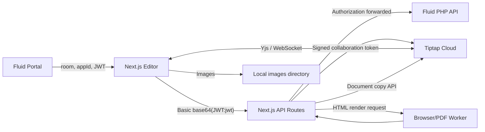

# Fluid Document Editor

Fluid Document Editor is a Next.js application built around Tiptap. It provides
real-time collaborative document editing, comments, version history, document
search, snapshots, PDF export, image upload, cover-page settings, metadata, and
document duplication.

The editor is normally opened from the Fluid portal with a document ID and a
business JWT:

```text
https://<editor-host>/<room>?token=<jwt>&appId=app1
```

Do not commit or share real JWTs, Tiptap secrets, PHP secrets, or registry
tokens.

## Project Layout

```text
Fluid/
├── README.md
├── images/                         # Runtime image storage
├── html/                           # Generated HTML used during PDF export
├── upload/                         # Runtime download/storage directory
├── Fluid_Editor_Technology_Stack.docx
├── Fluid_Editor_Technology_Stack.pdf
└── tiptap-templates/
    ├── package.json                # Workspace scripts
    ├── package-lock.json
    ├── .npmrc                      # Tiptap Pro registry configuration
    └── templates/
        └── next-block-editor-app/  # Main application
            ├── src/app/            # Next.js App Router pages and API routes
            ├── src/components/     # Editor UI, dialogs, comments, versions
            ├── src/extensions/     # Custom Tiptap extensions
            ├── src/hooks/          # Editor and collaboration hooks
            ├── src/lib/            # API, auth, Redux, and Tiptap helpers
            ├── public/
            ├── .env.example
            ├── next.config.js
            └── package.json
```

`src/app/api_backup/` contains an older copy of the API handlers. The active
handlers are under `src/app/api_document/`.

## Technology Stack

- Next.js 14 App Router
- React 19 and TypeScript
- Tiptap 2 with Tiptap Pro extensions
- Tiptap Collaboration Cloud and Hocuspocus provider
- Yjs collaborative document format
- Redux Toolkit
- Material UI, Radix UI, Tailwind CSS, and SCSS
- PHP backend API for users, file metadata, settings, snapshots, and saves
- `pdf-lib` plus a browser worker for PDF generation

The project uses private `@tiptap-pro` packages. Dependency installation
therefore requires valid access to the Tiptap Pro registry.

## Architecture



### Data Ownership

- Tiptap Cloud stores collaborative document content in Yjs format.
- The PHP backend stores file records, users, settings, snapshots, metadata,
  cover-page configuration, and other business data.
- The Next.js application acts as the editor UI and server-side integration
  layer.
- Local writable directories temporarily or permanently store images, HTML,
  and downloadable files.

## Document URL

The document route is:

```text
/<room>
```

Supported parameters:

| Parameter | Required | Description |
| --- | --- | --- |
| `token` | Yes for a new browser session | Fluid business JWT |
| `appId` | No | Tiptap application profile; defaults to `default` |
| `readonly=1` | No | Enables read-only mode |
| `noCollab=1` | No | Disables collaboration-provider initialization |

The `readonly` value may also be supplied in the URL hash.

Opening `/` creates a random room ID and redirects to it. Normal production
traffic should generally arrive from the Fluid portal with a valid room and
token.

## Authentication Flow

1. The editor reads `jwtToken` from a cookie, or reads `token` from the URL.
2. The token is stored in browser `localStorage` as `jwtToken`.
3. The client creates this authorization header:

   ```text
   Basic base64(<jwt>:jwt)
   ```

4. The Next.js API routes forward the header to the PHP API.
5. The collaboration route verifies the JWT with `PHP_JWT_SECRET`.
6. If direct verification fails, it calls the PHP `editor/userinfo` endpoint.
7. The route signs a Tiptap collaboration token using the selected app secret.

Token initialization must finish before the first authenticated file request.
Otherwise a new browser session can receive a 401 and then work only after a
refresh.

## Environment Variables

Create the application environment file:

```bash
cd tiptap-templates/templates/next-block-editor-app
cp .env.example .env
```

The current code references the following variables:

```dotenv
# PHP backend
NEXT_PUBLIC_PHP_API_BASE_URL=https://example.com/api/
PHP_JWT_SECRET=

# Default Tiptap application
NEXT_PUBLIC_TIPTAP_COLLAB_APP_ID=
TIPTAP_COLLAB_SECRET=
TIPTAP_API_SECRET=

# appId=app1
NEXT_PUBLIC_TIPTAP_COLLAB_APP_ID_1=
TIPTAP_COLLAB_SECRET_1=
TIPTAP_API_SECRET_1=
TIPTAP_AI_SECRET_1=

# Shared document naming
NEXT_PUBLIC_COLLAB_DOC_PREFIX=doc_

# Tiptap Convert
NEXT_PUBLIC_TIPTAP_CONVERT_APPID=
TIPTAP_CONVERT_SECRET=

# Tiptap AI
NEXT_PUBLIC_TIPTAP_AI_APP_ID=
TIPTAP_AI_SECRET=

# Optional generic JWT parser
JWT_SECRET=
```

Important:

- `NEXT_PUBLIC_*` values are included in the browser bundle. Never place a
  secret in one of these variables.
- Server secrets must be configured in the production runtime environment.
- `NEXT_PUBLIC_PHP_API_BASE_URL` must include the separator expected before
  paths such as `editor/file/...`.
- `TIPTAP_API_SECRET` values are required for server-side document
  copy/delete/read operations.
- `appId` profiles are defined in `src/lib/config.ts`.

## Installation

Use the workspace root for dependency installation:

```bash
cd tiptap-templates
npm install
```

The repository's `.npmrc` must contain a valid Tiptap Pro registry token:

```ini
@tiptap-pro:registry=https://registry.tiptap.dev/
//registry.tiptap.dev/:_authToken=${TIPTAP_PRO_TOKEN}
```

Prefer environment-variable substitution or deployment secret injection.
Never commit a live registry credential.

Node.js 20 or newer is recommended for the current Next.js and TypeScript
toolchain.

## Development

From `tiptap-templates/`:

```bash
npm run dev
```

Or run the application directly:

```bash
cd tiptap-templates/templates/next-block-editor-app
npm run dev
```

The default development address is:

```text
http://localhost:3000
```

Use a valid backend-issued JWT when testing authenticated routes.

## Build And Start

```bash
cd tiptap-templates
npm run build
npm run start
```

Direct application commands:

```bash
cd tiptap-templates/templates/next-block-editor-app
npm run build
npm run start
```

Type checking:

```bash
npx tsc --noEmit
```

Formatting:

```bash
npm run format
```

The current `npm run lint` command uses `next lint`. With the installed
Next.js/ESLint versions it may fail because of removed ESLint options. Align
`next`, `eslint`, and `eslint-config-next`, or replace the script with a direct
ESLint command before treating lint as a CI gate.

There is currently no automated test suite.

## Runtime Directories

The server writes files outside the application directory by resolving
`../../../` from the Next.js process working directory. When started from the
application directory, the expected directories are:

```text
Fluid/images/
Fluid/html/
Fluid/upload/
```

Create them before deployment and grant the application process write access:

```bash
mkdir -p images html upload
```

For a multi-instance or container deployment, replace local disk storage with
shared/persistent storage or ensure requests are consistently routed to the
same instance.

## Main Features

- Real-time collaborative editing
- Collaboration cursors and user identity
- Comments and unresolved-comment filtering
- Collaboration version history
- PHP-backed snapshots and snapshot restore
- Search and replace
- Table of contents
- Tables, tasks, code blocks, images, links, columns, and rich formatting
- DOCX import through Tiptap Convert
- Image upload with content-hash filenames
- PDF export with optional cover page
- Metadata and text-snippet placeholders
- Cover-page settings
- Make-a-copy workflow
- Read-only mode
- Light and dark display modes

## API Routes

| Next.js route | Method | Responsibility |
| --- | --- | --- |
| `/api_document/file` | GET | Load file/user information and perform cross-app document copying |
| `/api_document/collaboration` | POST | Validate the business user and create a Tiptap collaboration JWT |
| `/api_document/ai` | POST | Create a Tiptap AI JWT |
| `/api_document/getConvertToken` | POST | Create a Tiptap Convert JWT |
| `/api_document/setting` | GET | Proxy document settings from PHP |
| `/api_document/snapshot` | GET | Proxy paginated snapshots from PHP |
| `/api_document/snapshot_detail` | GET | Proxy one snapshot from PHP |
| `/api_document/tiptap` | POST | Save editor data through PHP |
| `/api_document/tiptap` | GET | Serve a file from `upload/` |
| `/api_document/upload` | POST | Save an uploaded image under its MD5 filename |
| `/api_document/upload` | GET | Serve an image from `images/` |
| `/api_document/export` | POST | Build HTML, request PDF rendering, and optionally merge a cover PDF |
| `/api_document/export` | GET | Serve generated HTML from `html/` to the PDF worker |

### PHP Endpoints Used

The Next.js layer calls these paths relative to
`NEXT_PUBLIC_PHP_API_BASE_URL`:

```text
editor/file/{room}/{appId}
editor/userinfo
editor/setting/{room}
editor/snapshot/{room}
editor/snapshotdetail/{id}
editor/save_tiptap
```

## Document Copying

The PHP file response may request a document copy using:

```json
{
  "usecontent": true,
  "old_appid": "default",
  "old_file_id": "SOURCE_FILE_ID"
}
```

The file route then:

1. Downloads `doc_<old_file_id>` from the source Tiptap app.
2. Deletes `doc_<room>` from the target app if it exists.
3. Saves the Yjs binary document into the target Tiptap app.
4. Reads the target document back for basic size verification.
5. Returns `copyDone` and, on failure, `copyError`.

This flow requires API secrets for both source and target app profiles.

## PDF Export

PDF export:

1. Loads document and cover settings from PHP.
2. Injects the built editor CSS into generated HTML.
3. Replaces account, form, metadata, and text-snippet placeholders.
4. Writes the generated HTML into `Fluid/html/`.
5. Sends the HTML URL to the configured browser worker.
6. Optionally renders and merges a cover-page PDF using `pdf-lib`.
7. Returns the final PDF as a browser download.

The current browser-worker URL is hard-coded in
`src/app/api_document/export/route.ts`. Treat it as deployment configuration
when moving the application between environments.

## Production Checklist

- Configure all required environment variables.
- Use valid Tiptap Collaboration and API secrets for every enabled `appId`.
- Confirm the PHP API is reachable from the Next.js server.
- Create writable `images/`, `html/`, and `upload/` directories.
- Run `npm run build` before starting the production server.
- Configure HTTPS and a reverse proxy.
- Preserve WebSocket access to Tiptap Cloud.
- Set request/body limits suitable for image uploads and PDF exports.
- Use persistent/shared storage when running multiple instances.
- Keep `.env`, JWTs, registry tokens, and Tiptap secrets out of Git.
- Rotate any credential that has been shared in URLs, logs, or committed files.
- Restrict or authenticate file-serving routes according to production policy.

## Troubleshooting

### First visit returns 401, refresh works

The business JWT was not persisted before `getFileInfo()` ran. Ensure
`API.sendTokenToServer()` completes before the first authenticated request.

### Collaboration does not connect

Check:

- The URL uses the expected `appId`.
- The matching collaboration App ID and secret are configured.
- `PHP_JWT_SECRET` matches the issuer.
- The PHP `editor/userinfo` fallback accepts the forwarded authorization header.
- The browser can reach Tiptap Cloud over WebSocket.

### Document copy fails

Check both source and target `TIPTAP_API_SECRET` values and inspect `copyError`
in the `/api_document/file` response.

### Images fail to upload

Confirm `Fluid/images/` exists and is writable by the Node.js process.

### PDF export fails

Confirm:

- `Fluid/html/` exists and is writable.
- The production origin can serve `/api_document/export?file=...`.
- The browser worker can access that origin.
- Built CSS exists under `.next/static/css`.
- PHP returns valid document settings.

### Dependency installation returns 401/403

The Tiptap Pro registry token is missing, expired, or unauthorized for the
required packages.

## Security Notes

- URL tokens can appear in browser history, proxy logs, screenshots, and
  referrer data. Prefer short-lived tokens and remove sensitive query values
  after initialization where possible.
- Never use the fallback value for `PHP_JWT_SECRET` in production.
- Do not log complete authorization headers or JWTs.
- Validate upload types and sizes before exposing the upload route publicly.
- Sanitize filenames and restrict file reads to prevent path traversal.
- Review the public GET file routes before exposing the service directly to the
  internet.
- Rotate the Tiptap registry credential currently used by local development if
  it has ever been committed or shared.
